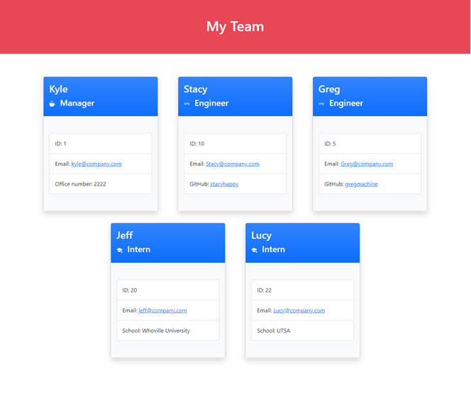
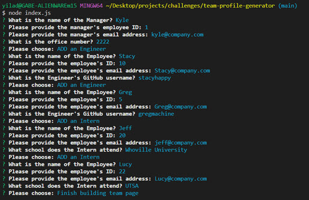

# Team Profile Generator

## Description

Quickly build a responsive HTML webpage summary of your engineering team with the Team Profile Generator via the command line.

---

## Video walkthrough of the application: [Link](https://drive.google.com/file/d/1HoGsD93zqE75p_Lj9a301Z1fFRx5X3hl/view)

---

## Table of Contents

- [Installation](#installation)
- [Usage](#usage)
- [Contributing](#contributing)
- [Tests](#tests)
- [Questions](#questions)

---

## Installation

Clone the repository and run NPM Install. This will provide you the npm Inquirer and Jest libraries.

---

## Usage

Free to use by anyone who is interested.

---

## Contributing

If you use this generator, please provide a link to this repository as credit.

---

## Tests

To test the classes, you will need to NPM Install which will provide the Jest library. In the command line, type 'npm test' to run the test suite.

---

## Questions

Please contact the owner with any questions.
Email: yiladien@hotmail.com
GitHub profile: https://github.com/Yiladien

---
